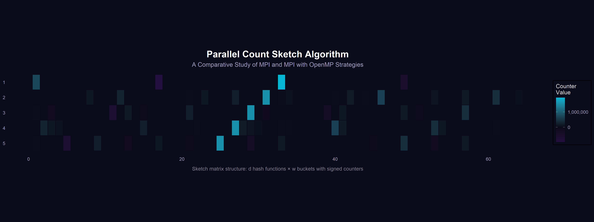

# Parallel Count Sketch for High-Performance Frequency Estimation

---

<div align="center">

          

</div>

---

***Assoc. prof. <a href="https://webapps.unitn.it/du/it/Persona/PER0228723/Didattica">Sandro Luigi Fiore</a>***  

**Group**: ***<u>Lo Iacono Andrea</u>***, ***<u>De Marco Matthew</u>***

<div align="center">

</div>

---

<details>
<summary><h2>Table of Contents</h2></summary>

- [Parallel Count Sketch for High-Performance Frequency Estimation](#parallel-count-sketch-for-high-performance-frequency-estimation)
  - [Project Overview](#project-overview)
  - [Parallelization Strategies](#parallelization-strategies)
  - [Requirements](#requirements)
    - [Hardware Requirements](#hardware-requirements)
    - [Software Requirements](#software-requirements)
  - [Building](#building)
  - [Generating Datasets](#generating-datasets)
  - [Running](#running)
    - [Sequential](#sequential)
    - [Pure MPI](#pure-mpi)
    - [Hybrid MPI + OpenMP](#hybrid-mpi--openmp)
  - [Cluster Deployment (PBS)](#cluster-deployment-pbs)
  - [Benchmarking](#benchmarking)
  - [Project Structure](#project-structure)
  - [Key Results](#key-results)
  - [References](#references)
  - [Acknowledgments](#acknowledgments)
  - [Team Members](#team-members)
  - [License](#license)

</details>

<!--=========================================================================-->

## Project Overview

---

This project implements and evaluates two parallel strategies for the **Count Sketch** algorithm, a probabilistic data structure for efficient frequency estimation in massive data streams. Count Sketch offers sublinear space complexity with bounded error guarantees, making it ideal for heavy hitter detection in network monitoring, real-time query tracking, and large-scale data analytics.

We provide:
1. A **sequential baseline** in C
2. A **pure MPI** distributed-memory implementation (Scatter–Reduce pattern)
3. A **hybrid MPI + OpenMP** implementation combining distributed and shared-memory parallelism

All implementations are benchmarked on the **UniTN HPC cluster** (126 nodes, 6092 CPU cores) across three dataset sizes (500K, 1M, 8M items) with strong and weak scaling analyses up to 64 processes.

**Course**: High Performance Computing for Data Science  
**Institution**: University of Trento, DISI  
**Academic Year**: 2025–2026

<!--=========================================================================-->

## Parallelization Strategies

---

| Strategy | Model | Communication | Synchronization | Best For |
|----------|-------|---------------|-----------------|----------|
| **Pure MPI** | Distributed memory | `MPI_Scatterv` + `MPI_Reduce` | None (private tables) | Multi-node, single process per node |
| **Hybrid MPI + OpenMP** | Distributed + shared memory | `MPI_Scatter` + `MPI_Reduce` | `#pragma omp atomic` | Multi-node, multi-threaded per node |

Both strategies exploit the **linearity** of Count Sketch: partial tables from disjoint data partitions can be summed element-wise to produce the exact same result as sequential processing.

<!--=========================================================================-->

## Requirements

---

### Hardware Requirements

- **CPU**: Multi-core processor (benchmarks use up to 64 cores)
- **RAM**: Minimum 4 GB (8 GB recommended for 8M datasets)

### Software Requirements

| Software | Version | Purpose |
|----------|---------|---------|
| GCC | 9.1+ | C compiler |
| CMake | 3.10+ | Build system |
| MPI (MPICH / OpenMPI) | 3.2+ | Distributed-memory parallelism |
| OpenMP | 4.5+ | Shared-memory parallelism (hybrid) |
| Python | 3.8+ | Dataset generation & plotting |
| NumPy | 1.20+ | Zipf distribution generation |

> [!NOTE]
> On **macOS (Apple Silicon)**, the CMakeLists.txt includes automatic detection for Homebrew's `libomp`. No additional configuration is needed.

<!--=========================================================================-->

## Building

---

```bash
# Clone the repository
git clone https://github.com/ADreLOI/HPC4DS-Project-COUNTSKETCH.git
cd HPC4DS-Project-COUNTSKETCH

# Build all targets (sequential, MPI, hybrid)
mkdir -p build && cd build
cmake ..
make
```

This produces three executables in the `build/` directory:

| Executable | Description |
|------------|-------------|
| `app_seq` | Sequential baseline |
| `app_mpi` | Pure MPI implementation |
| `app_hybrid` | Hybrid MPI + OpenMP implementation |

<!--=========================================================================-->

## Generating Datasets

---

Datasets are generated using a **Zipf distribution** (skew = 1.2) to simulate realistic heavy-hitter patterns:

```bash
# Generate a single dataset (e.g., 8M items)
python3 src/generator/generator.py --items 8388608 --output datasets/input_data_8388608.txt

# Generate all benchmark sizes at once
python3 src/generator/generator.py --batch
```

> [!TIP]
> Pre-generated datasets for 500K, 1M, and 8M items are already included in the `datasets/` directory.

<!--=========================================================================-->

## Running

---

### Sequential

```bash
./build/app_seq
```

### Pure MPI

```bash
# Usage: mpirun -np <P> ./build/app_mpi <depth> <buckets> <input_file> <scaling_mode>
#   scaling_mode: 0 = Strong Scaling, 1 = Weak Scaling

# Example: 8 processes, strong scaling
mpirun -np 8 ./build/app_mpi 5 1000 datasets/input_data_8388608.txt 0
```

### Hybrid MPI + OpenMP

```bash
# Usage: mpirun -np <P> ./build/app_hybrid <depth> <buckets> <input_file> <threads> <scaling_mode>

# Example: 4 ranks × 8 threads, strong scaling
mpirun -np 4 ./build/app_hybrid 5 1000 datasets/input_data_8388608.txt 8 0
```

> [!WARNING]
> Ensure that `num_processes × num_threads` does not exceed the available CPU cores on your system.

<!--=========================================================================-->

## Cluster Deployment (PBS)

---

The repository includes ready-to-use PBS scripts for the UniTN HPC cluster:

```bash
# Load required modules
module load gcc91
module load mpich-3.2.1--gcc-9.1.0

# Submit MPI benchmarks
qsub scripts/benchmark_mpi.pbs

# Submit Hybrid benchmarks
qsub scripts/benchmark_hybrid.pbs
```

PBS configurations request:
- **Queue**: `short_HPC4DS` / `short_cpuQ`
- **Resources**: 1 node, 64 CPUs, 5 GB RAM
- **Wall time**: 30 minutes

> [!IMPORTANT]
> Jobs are submitted with exclusive node access to eliminate resource contention and ensure reliable timing measurements.

<!--=========================================================================-->

## Benchmarking

---

Automated benchmark scripts run strong and weak scaling tests across multiple dataset sizes. e.g.:

```bash
# Strong scaling (MPI, 8M dataset)
bash scripts/benchmark_performance_mpi.sh

# Weak scaling (MPI, 8M dataset)
bash scripts/weak_scaling_mpi.sh

# Multi-size strong scaling (500K, 1M, 8M)
bash scripts/benchmark_all_sizes_mpi.sh

# Hybrid benchmarks
bash scripts/benchmark_performance_hybrid.sh
bash scripts/weak_scaling_hybrid.sh
```

Results are saved as CSV files in the `results/` directory and can be visualized with:

```bash
python3 src/utils/data\ analysis/plotter.py
```

<!--=========================================================================-->

## Project Structure

---

```
HPC4DS-Project-COUNTSKETCH/
├── CMakeLists.txt                   # Build configuration
├── README.md
├── LICENSE
│
├── src/
│   ├── main.c                       # Sequential implementation
│   ├── count_sketch_algorithm.c     # Core CS algorithm (sequential)
│   ├── include/
│   │   ├── count_sketch.h           # Data structures & API
│   │   └── count_sketch_mpi.h       # MPI utilities header
│   ├── parallel_mpi/
│   │   ├── main.c                   # Pure MPI entry point
│   │   └── count_sketch_algorithm.c # CS + MPI utilities (flatten, unflatten, etc.)
│   ├── parallel_mpi_openMP/
│   │   ├── main.c                   # Hybrid entry point
│   │   └── count_sketch_algorithm.c # CS with OpenMP atomic updates
│   ├── generator/
│   │   └── generator.py             # Zipf dataset generator
│   └── utils/
│       └── data analysis/
│           └── plotter.py           # General plotting utilities
│
├── datasets/                        # Input datasets (100K → 8M items)
├── results/                         # CSV benchmark outputs
├── scripts/                         # PBS job scripts & benchmark runners
└── test/                            # Unit tests
```

<!--=========================================================================-->

## Key Results

---

| Metric | Pure MPI (64P) | Hybrid (64P × best threads) |
|--------|---------------|---------------------------|
| **Compute Speedup** (8M) | 63.6× | 35.9× |
| **Total Speedup** (8M) | 11.1× | 4.4× |
| **Compute Efficiency** (8M) | 99.4% | 56.0% |

- Pure MPI achieves **near-linear compute scaling** due to embarrassingly parallel local updates with no synchronization overhead
- The hybrid approach provides flexibility through **two-level parallelism** but is constrained by atomic contention on high-traffic sketch buckets
- Both strategies are **communication-bound** at high process counts; the `MPI_Reduce` phase dominates total execution time


<!--=========================================================================-->

## References

---

1. Charikar, M., Chen, K., & Farach-Colton, M. (2002). *Finding frequent items in data streams*. ICALP.
2. Verma, R. et al. (2024). *Sparsifying Count Sketch*. arXiv:2402.xxxxx.
3. Higgins, J. et al. (2025). *GPU CountSketch Implementation*. arXiv:2501.xxxxx.
4. Ahfock, D. & Astle, W. (2020). *Statistical Properties of Sketching Algorithms*. Biometrika.
5. Yu, H. et al. (2016). *Parallel Count-Min Sketch on Multi-core Architectures*. ICDCS.

<!--=========================================================================-->

## Acknowledgments 

---

**High Performance Computing for Data Science** –  ***Assoc. prof. <a href="https://webapps.unitn.it/du/it/Persona/PER0228723/Didattica">Sandro Luigi Fiore</a>***  


<!--=========================================================================-->

## Team Members

---

- [Andrea Lo Iacono](https://github.com/ADreLOI) ([andrea.loiacono@studenti.unitn.it](mailto:andrea.loiacono@studenti.unitn.it))

- [Matthew De Marco](https://github.com/MattDema) ([matthew.demarco@studenti.unitn.it](mailto:matthew.demarco@studenti.unitn.it))

<!--=========================================================================-->

## License

---

This project is licensed under the MIT License — see the [LICENSE](LICENSE) file for details.

---

<p align="center">
  <a href="#parallel-count-sketch-for-high-performance-frequency-estimation" style="text-decoration: none;">
    
    <br>
    <strong>Back to Top</strong>
  </a>
</p>

---
